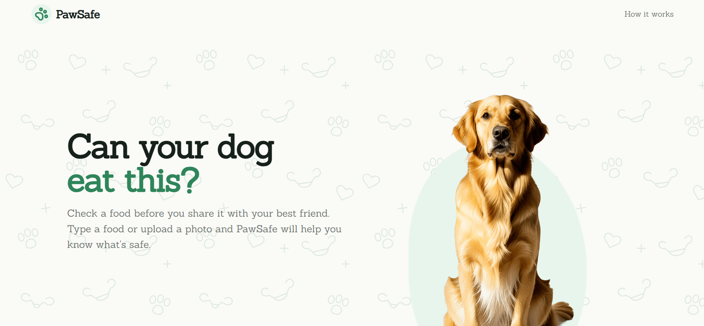
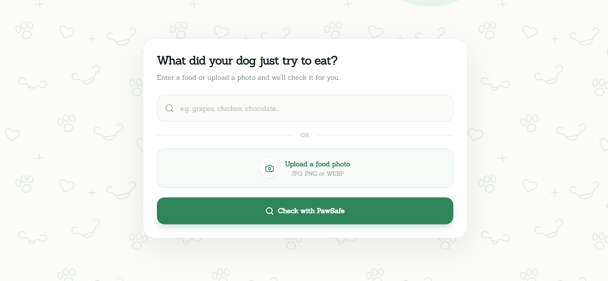
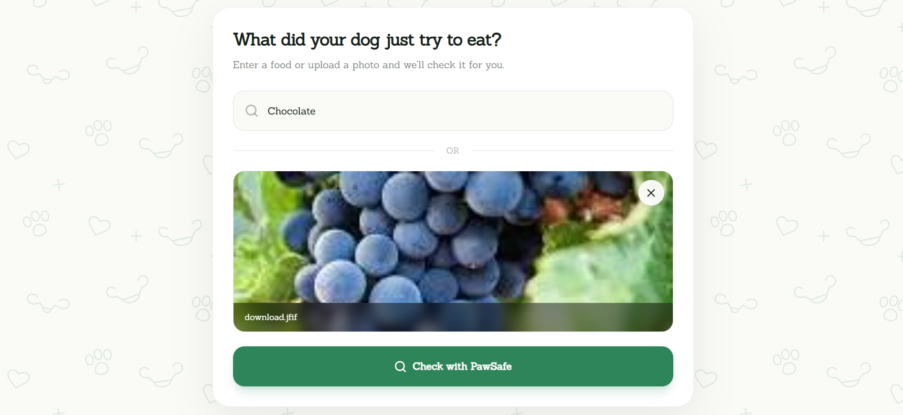
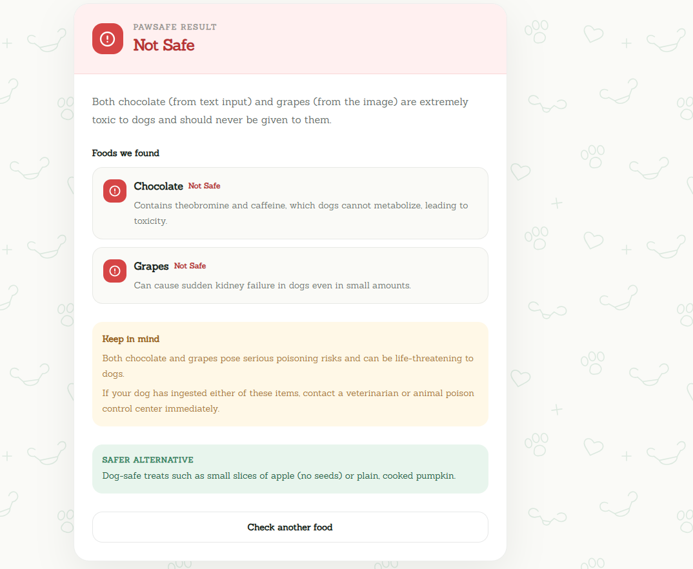
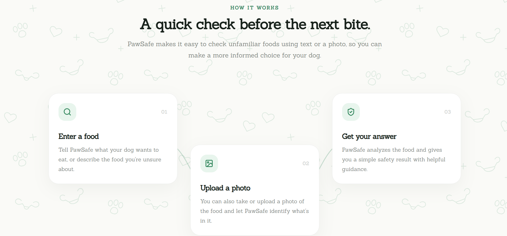

# 🐾 PawSafe

PawSafe is an AI-powered web application that helps dog owners check whether a food may be safe for their dogs.

Users can enter the name of a food, upload a photo, or provide both. PawSafe analyzes the provided information using Google's Gemini API and returns a simple safety assessment with helpful explanations, warnings, and safer alternatives when appropriate.

## 🚀 Live Demo

**[Try PawSafe](https://pawsafe-1.onrender.com/)**

## 📸 Screenshots

### Home



### Food Checker



### Food Checker Usage



### Food Analysis



### How It Works



## ✨ Features

- 🔎 Check foods by entering their name
- 📷 Upload an image of food for analysis
- 🧠 Analyze text and images independently or together
- 🟢 Generally Safe results
- 🟡 Use Caution results
- 🔴 Not Safe results
- ⚪ Unable to Determine results
- 📋 Explanations and reasons for each result
- ⚠️ Warnings when additional caution is needed
- 🌿 Safer alternative suggestions
- 📱 Responsive design for mobile, tablet, and desktop
- 🔄 Smooth result navigation after analysis

## 🧠 How It Works

PawSafe uses a React frontend and an Express backend to communicate with Google's Gemini API.

```text
User
  ↓
Food name / Image / Both
  ↓
React Frontend
  ↓
Express API
  ↓
Google Gemini
  ↓
Structured Analysis
  ↓
PawSafe Result Card
```

## 🛠️ Tech Stack

### Frontend

- React
- Vite
- Tailwind CSS
- Lucide React

### Backend

- Node.js
- Express
- Multer
- CORS
- Google Gemini API

### Deployment

- Render
- GitHub

## 📁 Project Structure

```text
PawSafe/
├── backend/
│   ├── routes/
│   │   └── analyze.js
│   ├── services/
│   │   └── gemini.js
│   ├── server.js
│   ├── package.json
│   └── .gitignore
│
├── frontend/
│   ├── public/
│   ├── src/
│   │   ├── components/
│   │   ├── services/
│   │   ├── App.jsx
│   │   ├── index.css
│   │   └── main.jsx
│   ├── package.json
│   └── vite.config.js
│
└── README.md
```

## 🔧 Getting Started

### Prerequisites

Make sure you have the following installed:

- Node.js
- npm
- Git

You will also need a Google Gemini API key.

### 1. Clone the Repository

```bash
git clone https://github.com/PaulEmmanuel8888/PawSafe.git
cd PawSafe
```

### 2. Set Up the Backend

```bash
cd backend
npm install
```

Create a `.env` file inside the backend directory:

```env
GEMINI_API_KEY=your_api_key_here
```

Start the backend development server:

```bash
npm run dev
```

The backend will run locally on:

```text
http://localhost:5000
```

### 3. Set Up the Frontend

Open another terminal and navigate to the frontend:

```bash
cd frontend
npm install
```

Start the Vite development server:

```bash
npm run dev
```

The frontend will be available at the local URL provided by Vite.

## 🔐 Environment Variables

The backend requires the following environment variable:

| Variable         | Description                |
| ---------------- | -------------------------- |
| `GEMINI_API_KEY` | Your Google Gemini API key |

Never commit your `.env` file or expose your API key publicly.

## 🤖 Google AI Integration

PawSafe uses Google's Gemini API to analyze food information provided by users.

The application supports:

- Text-based food analysis
- Image-based food analysis
- Combined text and image analysis
- Structured safety assessments
- Explanations and warnings
- Safer alternative suggestions

The Gemini API is accessed from the backend, keeping the API key away from the frontend.

## ⚠️ Disclaimer

PawSafe is intended for informational purposes only.

AI-generated results may be inaccurate or incomplete and should not be considered professional veterinary advice. If a dog has eaten something potentially harmful or is experiencing symptoms, users should contact a qualified veterinarian.

## 🎯 Why I Built PawSafe

I built PawSafe as a simple way to address a common problem for dog owners: "Can my dog eat this?"

Instead of searching through multiple sources whenever a food is unfamiliar, PawSafe provides a quick way to check a food using either its name or a photo.

## 🚧 Future Improvements

Some ideas for future versions include:

- 🐕 More detailed breed and portion guidance
- 📚 A searchable database of commonly checked foods
- 📜 Analysis history
- ⭐ Saved or favorite foods
- 🌍 Support for additional languages
- 🩺 More detailed veterinary guidance and emergency resources

## 👨‍💻 Built By

**Emmanuel Paul**

Built as part of the DEV Community Weekend Challenge: Dog Days Edition.

## 📄 License

This project is available for educational and portfolio purposes.
